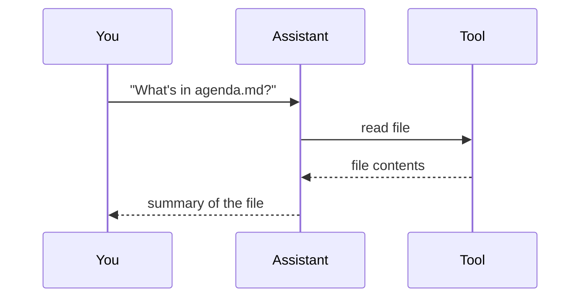

# Agenda

A short walkthrough of how AI assistants work — and how to get more out of them.

---

## What's an LLM?

A **Large Language Model (LLM)** is the AI behind tools like ChatGPT, Copilot, and Claude. It reads your words and writes a response, one word at a time — like a very advanced autocomplete.

You've already used this idea: your phone suggests the next word as you type. An LLM does the same thing, trained on a huge amount of text so it can hold a conversation, answer questions, and help with work.

*Source URL: https://support.apple.com/en-ge/guide/ipod-touch/iphd4ea90231/ios*

At a larger scale, the model takes what you've written so far, predicts the next word, adds it, and repeats — building a full answer step by step.

*Source URL: https://www.nature.com/articles/s41586-023-06647-8*

---

### Hallucination

Because an LLM predicts the *next likely word*, it is optimized to sound fluent and helpful — not to guarantee that every statement is true. When the model fills a gap with something plausible but wrong, that is called a **hallucination**.

It can happen in subtle ways: inventing a book title, citing a paper that does not exist, naming a function that is not in an API, or stating a date or number with full confidence when it is off by a mile. The answer often *reads* correct even when it is not.

This is not a random bug. The model has no built-in way to "look things up" or "know" facts the way you do. It is pattern-matching from training data and guessing the most convincing continuation. When it does not have enough to go on, it may still produce a complete-sounding answer rather than saying "I don't know."

**What helps:**

- Treat the AI as a fast draft, not a final authority — especially for names, dates, citations, and anything consequential.
- For facts that must be right, verify against a trusted source (or let the assistant use tools — covered next).

**In plain terms:** hallucination is when the AI sounds sure but is wrong. Expect it, check what matters, and use tools or your own judgment when the stakes are high.

---

### Tool Calling

On its own, an LLM only generates text. It cannot check your calendar, read a file on your computer, or look up today's weather — unless something else gives it that ability.

**Tool calling** is how that works. Instead of only writing words, the model can *request* an action: search the web, open a document, run a calculation, call an API. The app runs the tool, feeds the result back to the model, and the model uses that information to finish its answer.

A single question can trigger several tool calls in a row — read a file, then search for related docs, then draft a reply — before you see the final response.

**In plain terms:** tool calling turns the AI from a text generator into something that can *do* things in the world (through the tools you connect), not just talk about them.

---

## Skills

A **skill** is a reusable guide you give the AI for a specific kind of task — like a cheat sheet or playbook.

Instead of explaining your process every time ("always start with a summary," "use this tone for customer emails"), you write it once. When a similar task comes up, the AI can follow those instructions.

**In plain terms:** skills turn your know-how into reusable instructions the AI can pick up when it needs them.

---

## Commands

A **command** is a shortcut that starts a specific workflow. Instead of writing a long prompt from scratch, you trigger a ready-made process with a simple phrase or button.

**In plain terms:** the agent is the worker that can act on your behalf; commands are the shortcuts that tell it what kind of job to start.
